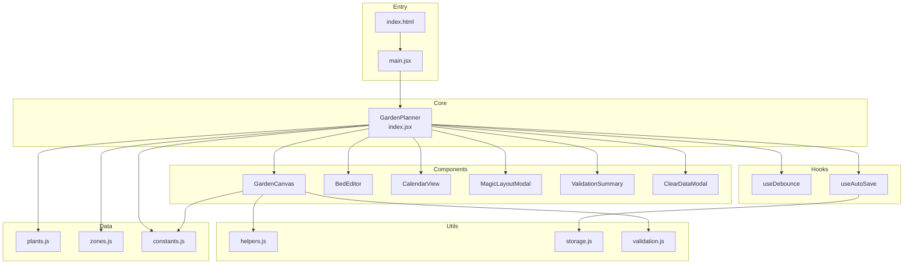
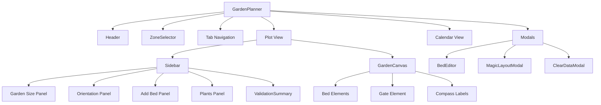
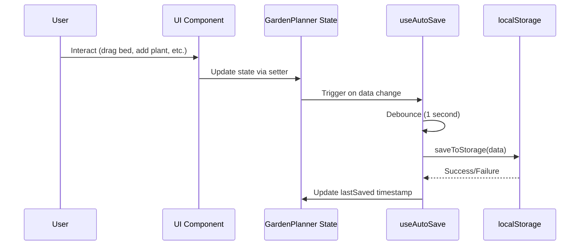
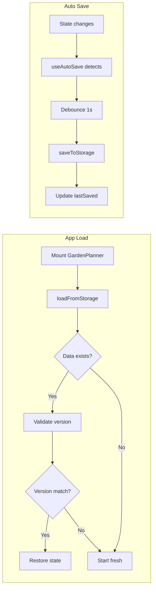
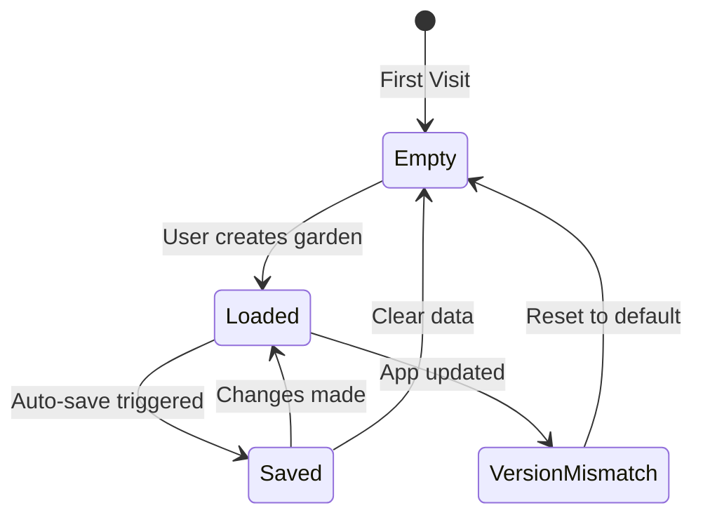

# Rooty - Technical Summary

**Last Updated**: December 2024

This document provides a comprehensive technical overview of the Rooty garden planner application, including architecture, components, data flow, and design decisions.

---

## Table of Contents

1. [Architecture Overview](#architecture-overview)
2. [Component Hierarchy](#component-hierarchy)
3. [Data Flow](#data-flow)
4. [State Management](#state-management)
5. [Component Documentation](#component-documentation)
6. [Data Layer](#data-layer)
7. [Custom Hooks](#custom-hooks)
8. [Utility Functions](#utility-functions)
9. [Key Design Decisions](#key-design-decisions)
10. [Storage and Persistence](#storage-and-persistence)

---

## Architecture Overview

Rooty is a single-page React application built with Vite as the build tool and Tailwind CSS for styling. The application follows a component-based architecture with centralized state management in the root component.



### Technology Stack

| Layer | Technology |
|-------|------------|
| Framework | React 18.3.1 |
| Build Tool | Vite 6.0.3 |
| Styling | Tailwind CSS 3.4.17 |
| Icons | Lucide React 0.468.0 |
| State | React useState/useEffect |
| Persistence | localStorage |

---

## Component Hierarchy



---

## Data Flow

### User Interaction Flow



### Load and Save Flow



---

## State Management

All application state is managed in the root `GardenPlanner` component and passed down via props. There is no external state management library.

### State Categories

| Category | State Variables | Purpose |
|----------|-----------------|---------|
| Loading | `isLoaded` | Prevents rendering before localStorage load |
| UI | `activeTab`, `editingBed`, `showMagic`, `showClearModal` | Controls which views/modals are active |
| Garden Data | `selectedZone`, `gardenPlan`, `beds`, `trellises` | Core garden configuration |
| Dimensions | `gardenWidthInput`, `gardenLengthInput` | User input (debounced to actual values) |
| Layout | `orientation`, `isFenced`, `gatePosition`, `gateWidth`, `walkwayWidth` | Garden orientation and fencing |
| Forms | `newBedName`, `newBedType`, `newBedWidth`, `newBedLength`, `newBedTrellis`, `selectedPlant`, `addBedError` | Bed creation form state |

### Derived Values

```javascript
const zone = ZONES[selectedZone];                    // Zone data object
const year = getPlantingYear(zone);                  // Current planting year
const spaceUsage = calculateSpaceUsage(beds, gardenWidth, gardenLength);  // Usage stats
```

---

## Component Documentation

### GardenPlanner (index.jsx)

The root component containing all application state and logic. Responsible for:

- Loading/saving data from localStorage
- Managing all state via `useState` hooks
- Coordinating between child components
- Handling bed CRUD operations
- Applying magic layout results

**Key Functions:**

| Function | Purpose |
|----------|---------|
| `addPlant()` | Add plant key to garden plan |
| `addBed()` | Create new bed with validation |
| `saveBed(updated)` | Update existing bed |
| `applyMagicLayout(result, settings)` | Apply AI layout suggestions |
| `clearAllData()` | Reset all state and clear storage |

### GardenCanvas (components/GardenCanvas.jsx)

Interactive canvas for visual garden layout. Handles:

- Bed rendering with type-specific styling
- Drag-and-drop bed positioning (snaps to 0.5ft grid)
- Corner resize handles for bed dimensions
- Fence border with draggable gate
- Collision preview during drag operations
- Compass direction labels

**Props:**

| Prop | Type | Description |
|------|------|-------------|
| `gardenWidth` | number | Garden width in feet |
| `gardenLength` | number | Garden length in feet |
| `beds` | array | Array of bed objects |
| `setBeds` | function | Bed state setter |
| `orientation` | string | N/S/E/W |
| `onEditBed` | function | Callback to open bed editor |
| `isFenced` | boolean | Whether garden has fence |
| `gatePosition` | number | 0-1 position along perimeter |

**Canvas Scaling:**

```javascript
const scale = Math.min(500 / gardenWidth, 350 / gardenLength, 40);
```

### BedEditor (components/BedEditor.jsx)

Modal dialog for editing bed properties:

- Bed name and type
- Dimensions (width/length)
- Trellis attachment selection
- Plant assignment from garden plan

**Props:**

| Prop | Type | Description |
|------|------|-------------|
| `bed` | object | Bed being edited |
| `onSave` | function | Save callback |
| `onCancel` | function | Cancel callback |
| `gardenPlan` | array | Available plant keys |

### CalendarView (components/CalendarView.jsx)

12-month planting calendar showing:

- Frost dates for selected zone (highlighted columns)
- Indoor start times
- Direct sow / transplant dates
- Harvest windows

**Activity Types:**

| Type | Color | Description |
|------|-------|-------------|
| indoor | Purple | Start seeds indoors |
| sow | Green | Direct sow outdoors |
| transplant | Blue | Transplant seedlings |
| harvest | Amber | Harvest period |

### MagicLayoutModal (components/MagicLayoutModal.jsx)

AI-assisted layout optimization modal offering:

- Layout style options (efficient, accessible, companion-focused)
- Walkway width configuration
- Simulated optimization with efficiency metrics

**Layout Styles:**

| Style | Description |
|-------|-------------|
| efficient | Maximize planting space |
| accessible | Wider paths for mobility |
| companion | Group by plant compatibility |

### ValidationSummary (components/ValidationSummary.jsx)

Displays validation warnings for bed placement:

- Out-of-bounds errors
- Collision/overlap warnings
- Walkway spacing violations

---

## Data Layer

### Plant Database (data/plants.js)

**VEGETABLES** - 20 edible plants with properties:

```javascript
{
  name: string,           // Display name
  emoji: string,          // Icon
  spacing: number,        // Feet between plants
  trellis: boolean,       // Needs vertical support
  startIndoors: number,   // Weeks before last frost (negative)
  transplant: number,     // Weeks after last frost
  directSow: number,      // Weeks after last frost (alternative to transplant)
  harvest: number,        // Weeks after planting
  companions: string[],   // Compatible plants
  avoid: string[]         // Incompatible plants
}
```

**COMPANIONS** - 10 beneficial herbs/flowers:

```javascript
{
  name: string,
  emoji: string,
  spacing: number,
  trellis: boolean,
  benefit: string,        // What pest/benefit it provides
  companions: string[]
}
```

### Zone Data (data/zones.js)

USDA hardiness zones 3a through 10b:

```javascript
{
  name: string,
  lastFrost: { month: number, day: number },   // Spring frost date
  firstFrost: { month: number, day: number }   // Fall frost date
}
```

### Constants (data/constants.js)

**BED_TYPES:**

| Key | Name | Visual |
|-----|------|--------|
| raised | Raised Bed | Amber background |
| inground | In-Ground | Light amber |
| planter | Planter/Pot | Stone gray |
| container | Container | Gray |

**TRELLIS_TYPES:**

| Type Category | Examples |
|---------------|----------|
| attachment | A-Frame, Arch, Vertical Panel, Tomato Cage |
| connector | Tunnel, Garden Arbor, Cattle Panel Arch |

**Configuration Constants:**

| Constant | Value | Purpose |
|----------|-------|---------|
| STORAGE_KEY | `garden-planner-data` | localStorage key |
| STORAGE_VERSION | 3 | Data schema version |
| GATE_CORNER_EXCLUSION | 2 | Feet from corner where gate cannot be placed |

---

## Custom Hooks

### useDebounce

```javascript
function useDebounce(value, delay): debouncedValue
```

Debounces input values to prevent excessive re-renders during typing. Used for garden dimension inputs with 500ms delay.

### useAutoSave

```javascript
function useAutoSave(data, delay = 1000): lastSaved
```

Automatically saves data to localStorage after a delay. Returns the timestamp of the last successful save. Skips initial render to prevent saving during load.

---

## Utility Functions

### helpers.js

| Function | Purpose |
|----------|---------|
| `generateId()` | Creates random 9-character ID |
| `formatLastSaved(date)` | Human-readable relative time |
| `getPlantingYear(zone)` | Determines current growing season year |
| `clamp(value, min, max)` | Constrain value to range |
| `roundToHalf(value)` | Round to nearest 0.5 |
| `perimeterToXY(t, width, height)` | Convert 0-1 perimeter position to x,y coordinates |
| `getPerimeterPosition(x, y, width, height)` | Convert x,y to perimeter position |
| `isValidGatePosition(t, width, height, gateWidth, cornerExclusion)` | Validate gate not in corners |

### validation.js

| Function | Purpose |
|----------|---------|
| `bedsOverlap(bed1, bed2, padding)` | Check if two beds overlap with optional padding |
| `bedInBounds(bed, gardenWidth, gardenLength)` | Check if bed is within garden |
| `bedsAreEndToEnd(bed1, bed2)` | Check if beds form a row (no walkway needed) |
| `bedHasCollision(bed, allBeds, excludeId, walkwayWidth)` | Check for any collisions |
| `validateBedPosition(bed, allBeds, ...)` | Full validation with error messages |
| `findValidPosition(newBed, existingBeds, ...)` | Find first valid placement |
| `snapToValidPosition(bed, allBeds, ...)` | Snap dragged bed to nearest valid spot |
| `calculateSpaceUsage(beds, gardenWidth, gardenLength)` | Calculate area statistics |
| `canBedFit(width, length, gardenWidth, gardenLength)` | Check if bed fits in garden |

### storage.js

| Function | Purpose |
|----------|---------|
| `loadFromStorage()` | Load and validate data from localStorage |
| `saveToStorage(data)` | Save with version wrapper |
| `clearStorage()` | Remove all saved data |

---

## Key Design Decisions

### 1. Centralized State in Root Component

**Decision**: All state lives in `GardenPlanner` rather than using Context or Redux.

**Rationale**: The component tree is shallow (max 2 levels deep), and prop drilling is minimal. This keeps the codebase simple and easy to understand.

### 2. localStorage with Version Control

**Decision**: Data is stored with a version number that triggers fresh start on mismatch.

**Rationale**: Allows schema changes without complex migration logic. Users start fresh if data format changes.

### 3. Debounced Dimension Inputs

**Decision**: Garden width/length inputs are debounced before affecting canvas.

**Rationale**: Prevents jarring re-renders while typing and reduces validation overhead.

### 4. Grid Snapping at 0.5ft Increments

**Decision**: Bed positions snap to half-foot grid during drag.

**Rationale**: Provides clean alignment while maintaining precision. Matches common garden measurement conventions.

### 5. Perimeter-Based Gate Positioning

**Decision**: Gate position is stored as 0-1 value along the perimeter rather than absolute coordinates.

**Rationale**: Simplifies dragging along edges and automatically handles garden dimension changes.

### 6. End-to-End Bed Exception for Walkways

**Decision**: Beds that align perfectly (forming a row) do not require walkway spacing between them.

**Rationale**: Allows users to create extended growing areas from multiple beds while still enforcing walkways between parallel rows.

---

## Storage and Persistence

### Data Schema (v3)

```javascript
{
  version: 3,
  savedAt: "ISO date string",
  data: {
    gardenWidth: number,
    gardenLength: number,
    orientation: "N" | "S" | "E" | "W",
    selectedZone: string,
    beds: [{
      id: string,
      name: string,
      type: "raised" | "inground" | "planter" | "container",
      width: number,
      length: number,
      x: number,
      y: number,
      plants: [{ id: string, type: string, x: number, y: number }],
      trellis: string | null
    }],
    gardenPlan: string[],    // Plant keys
    trellises: [],           // Standalone trellises (future feature)
    isFenced: boolean,
    gatePosition: number,    // 0-1
    gateWidth: number,
    walkwayWidth: number
  }
}
```

### Storage Lifecycle



---

## File Reference

| File | Lines | Purpose |
|------|-------|---------|
| `index.jsx` | 623 | Main application component |
| `components/GardenCanvas.jsx` | 352 | Interactive canvas |
| `components/BedEditor.jsx` | 199 | Bed editing modal |
| `components/MagicLayoutModal.jsx` | 201 | AI layout modal |
| `components/CalendarView.jsx` | 168 | Planting calendar |
| `components/ValidationSummary.jsx` | 57 | Validation display |
| `data/plants.js` | 289 | Plant database |
| `data/zones.js` | 20 | USDA zone data |
| `data/constants.js` | 94 | Configuration constants |
| `hooks/useDebounce.js` | 18 | Debounce hook |
| `hooks/useAutoSave.js` | 41 | Auto-save hook |
| `utils/helpers.js` | 114 | Helper functions |
| `utils/storage.js` | 50 | localStorage wrapper |
| `utils/validation.js` | 177 | Bed validation logic |

---

*Documentation maintained by George. For quick start guide, see [README.md](./README.md).*
